# Unity Environment Mapping

基于 Unity Built-in Render Pipeline 的环境映射与材质练习项目。从 Cubemap 环境反射出发，逐步学习 IBL、Spherical Harmonics、Reflection Probe 与 Light Probe，最后综合实现玉石材质。

  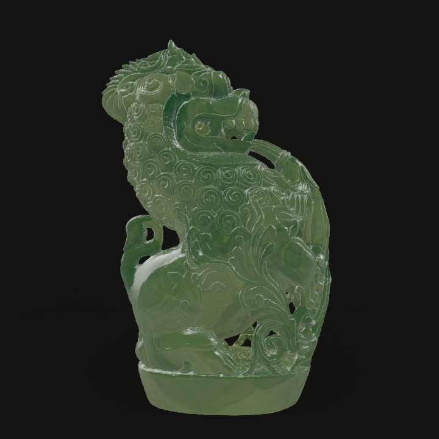
  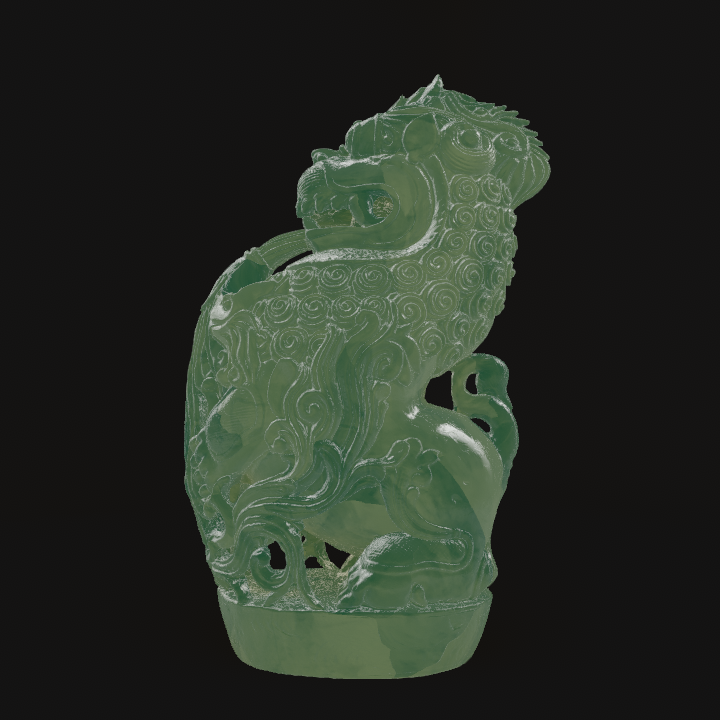

## Cubemap 与 Reflection Probe

- 使用世界空间视线和法线计算反射方向，再采样 Cubemap。
- 理解 LatLong 全景图与 Cubemap 的方向映射关系。
- 使用 HDR 环境贴图保留高亮度信息，并进行 HDR 解码。
- 加入 Normal Map 与 AO，丰富反射细节和结构层次。
- 使用 Reflection Probe 获取场景局部环境反射。

  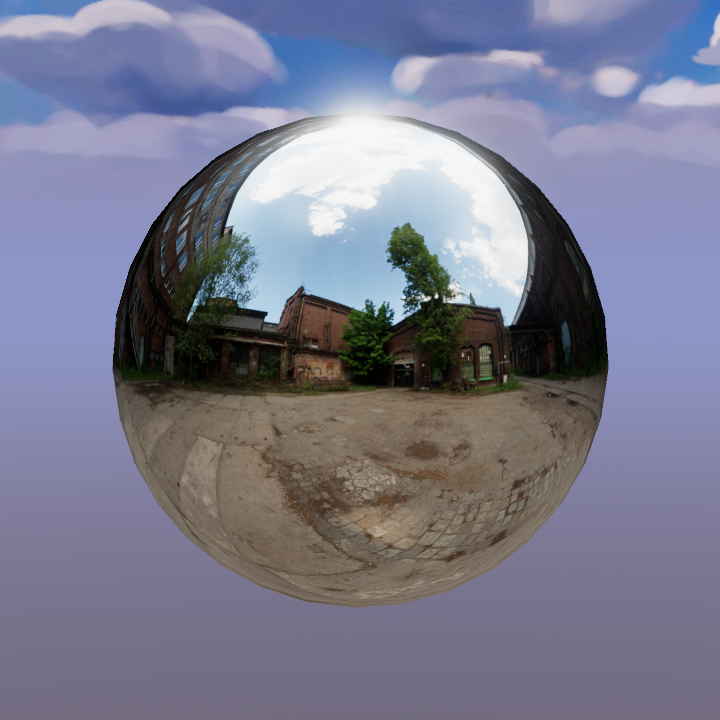
  
  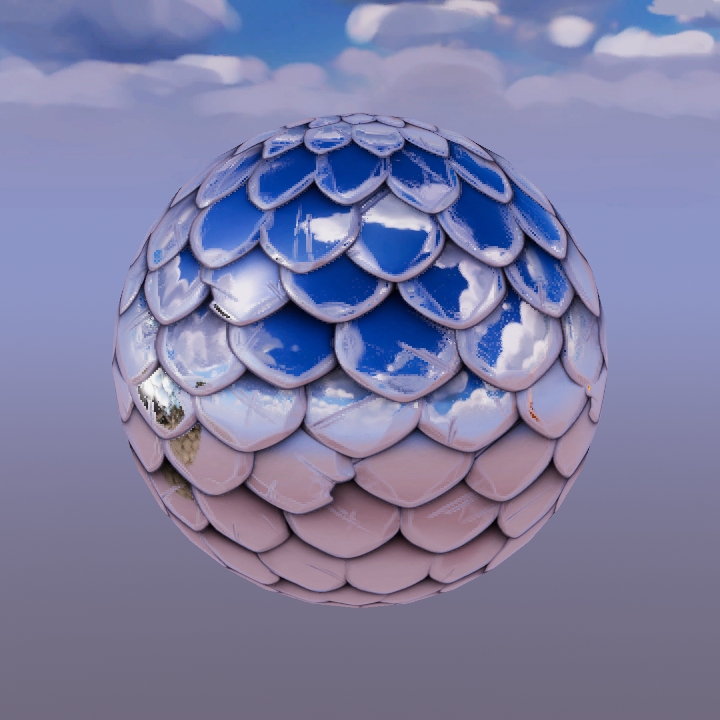

## Image-Based Lighting

- **Specular IBL**：根据反射方向采样预过滤 Cubemap。
- **Roughness**：使用粗糙度控制 Mipmap 层级，形成清晰或模糊的环境反射。
- **Diffuse IBL**：按法线方向获取低频环境颜色，近似环境漫反射。
- **Reflection Probe IBL**：使用 Unity 提供的局部 Probe 数据替代固定 Cubemap。
- 环境贴图是光照数据，IBL 是利用环境贴图计算光照的方法。

  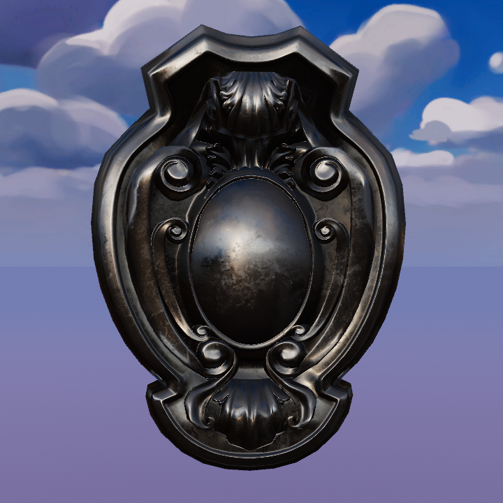
  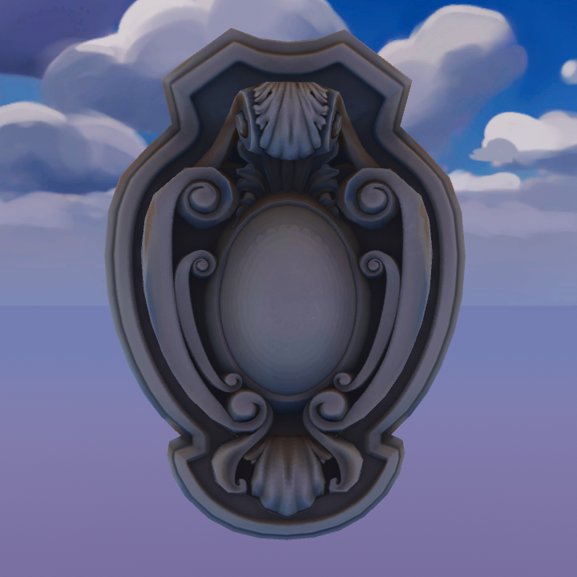
  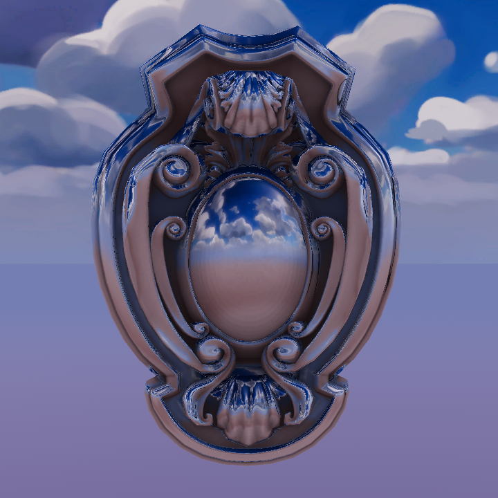

## Spherical Harmonics 与 Light Probe

- SH 使用少量系数近似低频环境光，适合表现漫反射间接光。
- 项目实现了二阶 SH 的手动求值，用于理解 Unity 的 SH 数据结构。
- Light Probe 在空间中烘焙并保存 SH，动态物体可在探针之间插值环境光。
- Reflection Probe 主要提供高频镜面反射，Light Probe 主要提供低频漫反射光照。

  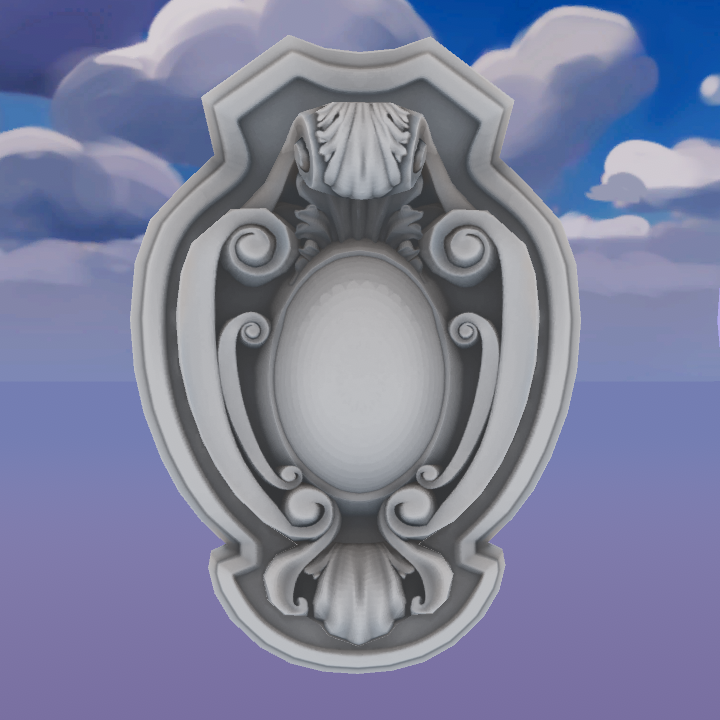
  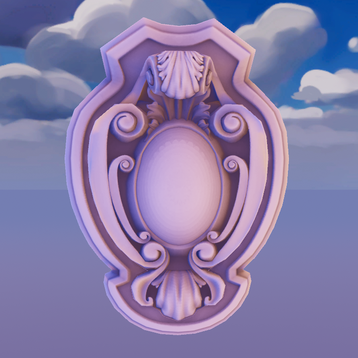

## 玉石材质

最终材质由以下部分组合：

- **基础漫反射与天光**：保留玉石固有色和实体感。
- **厚度背光透射**：根据视线、光线、法线与 Thickness Map 近似薄处透光。
- **环境反射**：通过 Cubemap 表现光滑表面。
- **Fresnel**：增强轮廓区域反射，减弱正面反射。
- **ForwardAdd**：为点光源和聚光灯逐灯叠加带衰减的透射光。
- 该效果是实时视觉近似，并非物理精确的次表面散射。

| 漫反射 | 厚度透射 | Cubemap 反射 |
| --- | --- | --- |
| 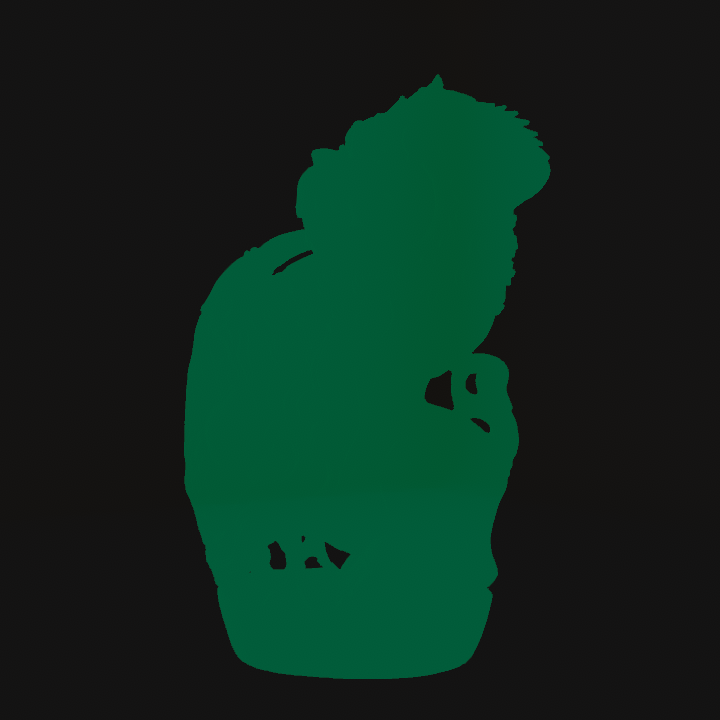 | 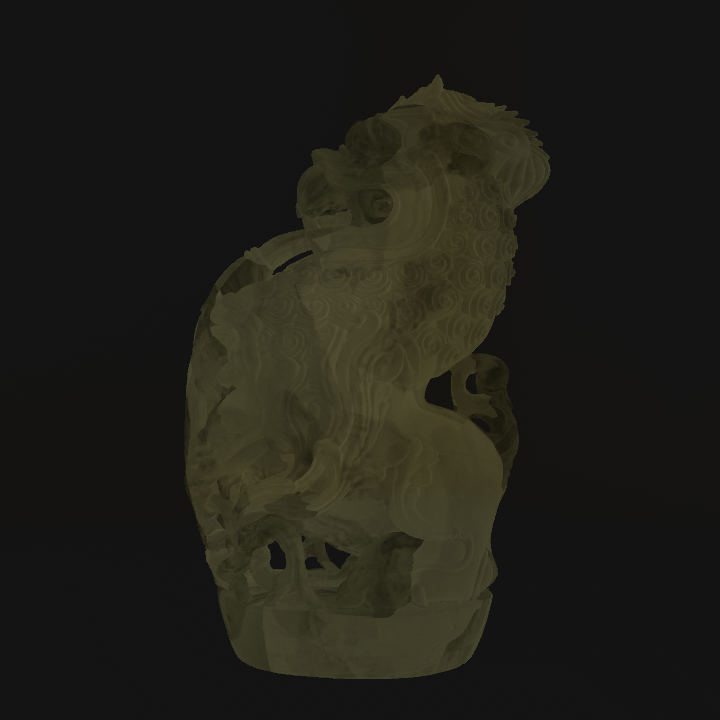 | 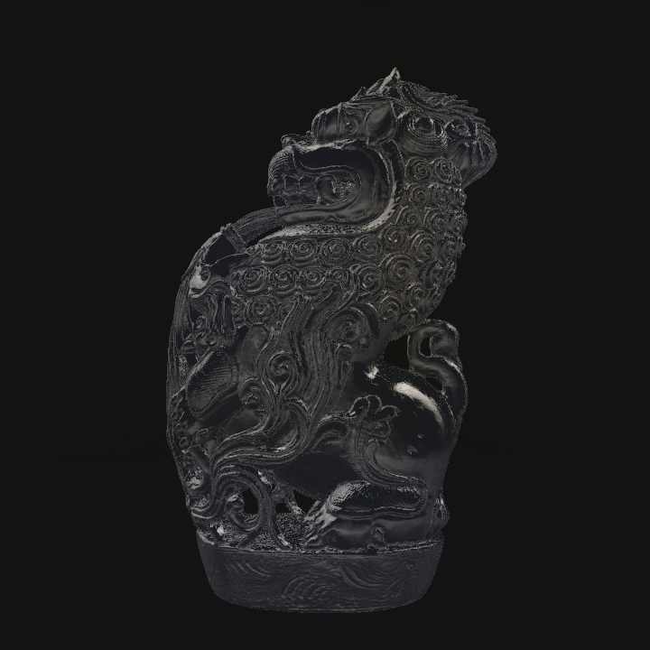 |

| Fresnel | ForwardAdd | 最终效果 |
| --- | --- | --- |
| 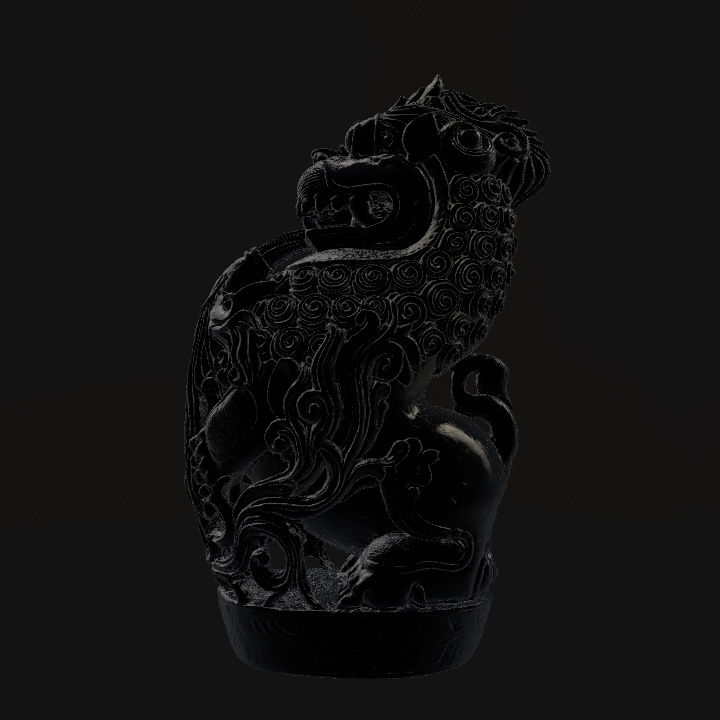 | 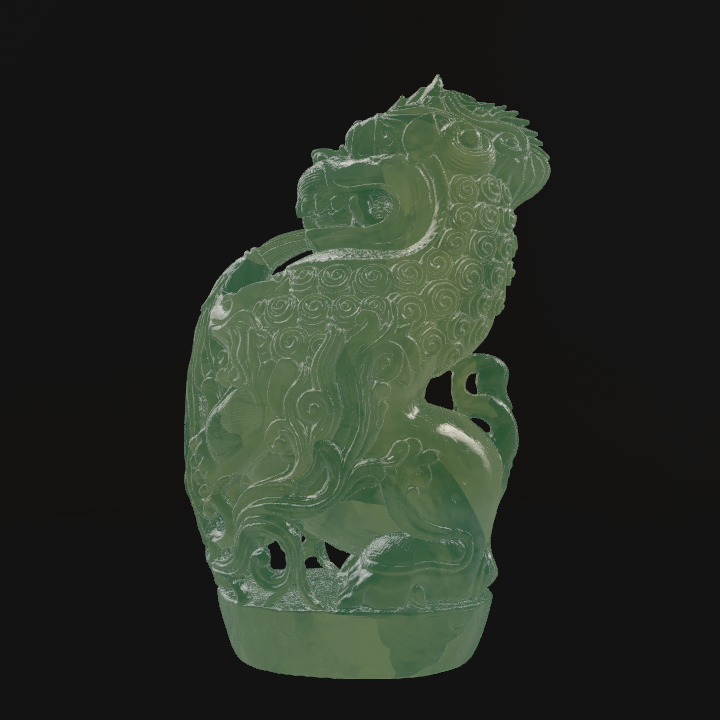 |  |

## 项目信息

- Unity `6000.3.16f1`
- Built-in Render Pipeline
- Post Processing `3.5.4`
- ShaderLab / HLSL
- Git LFS
